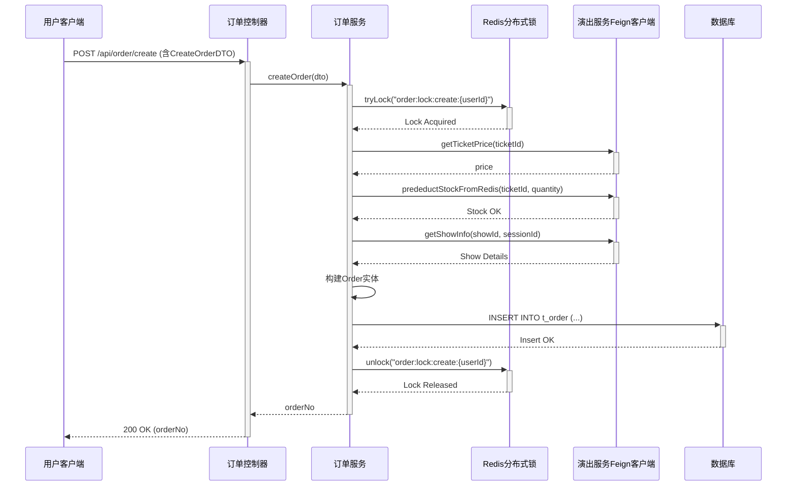

# 订单创建流程详解

本文档详细描述了票务系统中从用户发起请求到订单成功创建的完整后端处理流程。

---

## 一、流程概述

订单创建是一个涉及多个组件协作的复杂过程，其核心由`ticket-order`服务负责。整个流程高度关注高并发场景下的数据一致性，通过**分布式锁**、**Redis预减库存**和**补偿机制**来确保系统的稳定性和可靠性。主要交互方包括：

- **用户客户端**：发起创建订单的HTTP请求。
- **`ticket-order` 服务**：核心订单处理服务，负责编排整个创建流程。
- **`ticket-show` 服务**：提供票务、场次信息及库存管理能力。
- **Redis**：用作分布式锁和高性能的预减库存操作。
- **MySQL数据库**：订单数据的最终持久化存储。

---

## 二、核心组件分析

1.  **`OrderController.java`**
    - **API 入口**: `POST /api/order/create`
    - **职责**: 接收前端的HTTP请求，从请求头中获取并验证用户ID，调用`OrderService`处理业务逻辑。

2.  **`CreateOrderDTO.java`**
    - **数据传输对象 (DTO)**
    - **职责**: 定义了创建订单API的请求体结构，包含了`userId`, `showId`, `sessionId`, `ticketId`, `quantity`等关键字段，并利用Validation注解进行基础参数校验。

3.  **`OrderServiceImpl.java`**
    - **核心业务逻辑层**
    - **职责**: 实现订单创建的完整业务逻辑，是整个流程中最复杂的部分（详见下一章节）。

4.  **`Order.java`**
    - **实体类 (Entity)**
    - **职责**: 映射数据库中的`t_order`表，定义了订单对象的完整数据结构。

5.  **`OrderMapper.java`**
    - **数据访问层 (DAO)**
    - **职责**: 继承自MyBatis-Plus的`BaseMapper`，提供了对`t_order`表的CRUD（增删改查）能力，无需编写具体的SQL语句。

---

## 三、详细处理步骤

订单创建的核心逻辑均在`OrderServiceImpl.createOrder`方法中实现，具体步骤如下：

1.  **获取分布式锁**
    - 使用`RedissonClient`，以`order:lock:create:{userId}`作为锁的Key。
    - **目的**: 防止同一用户在短时间内重复提交订单请求，确保操作的幂等性。
    - 采用带重试的锁获取机制，提升系统在高负载下的成功率。

2.  **参数校验**
    - 对`ticketId`和`quantity`等关键业务参数进行二次校验，确保其合法性。

3.  **获取票价信息**
    - 通过`ShowFeignClient`（RPC调用）请求`ticket-show`服务，获取指定`ticketId`的单价。
    - **目的**: 确保订单总金额计算的准确性。该调用同样包含重试机制。

4.  **生成订单号**
    - 在预减库存前，先生成一个唯一的订单号（`tempOrderNo`），用于后续可能需要的补偿流程记录。

5.  **Redis 预减库存**
    - 再次通过`ShowFeignClient`调用`ticket-show`服务的`predeductStockFromRedis`接口。
    - **目的**: 在高性能的Redis中预先扣减库存，快速过滤掉无效请求，减轻数据库压力。这是应对高并发抢票场景的关键步骤。
    - 如果调用失败或库存不足，流程终止，并向上层抛出异常。
    - 此步骤包含完善的**补偿机制**，若调用失败会尝试重试或记录失败日志以便后续处理。

6.  **获取演出/场次信息**
    - 库存预减成功后，通过`ShowFeignClient`获取演出、场次、座位等详细信息。
    - **目的**: 丰富订单内容，用于最终展示和记录。
    - **异常处理**: 如果此步失败，系统会尝试**回滚**之前在Redis中预减的库存，并终止订单创建。

7.  **构建订单实体 (`Order`)**
    - 将`CreateOrderDTO`中的数据以及前面步骤获取的信息（如计算出的总金额）填充到一个新的`Order`对象中。
    - 设置订单初始状态为`0`（待支付），并设定一个15分钟的支付过期时间`expireTime`。

8.  **持久化订单**
    - 调用`OrderMapper.save(order)`方法，将订单实体插入到数据库的`t_order`表中。

9.  **释放分布式锁**
    - 在`finally`代码块中执行，确保无论成功或失败，锁最终都会被释放，避免死锁。

10. **返回订单号**
    - 将生成的订单号返回给`Controller`，并最终响应给用户。

---

## 四、交互时序图

