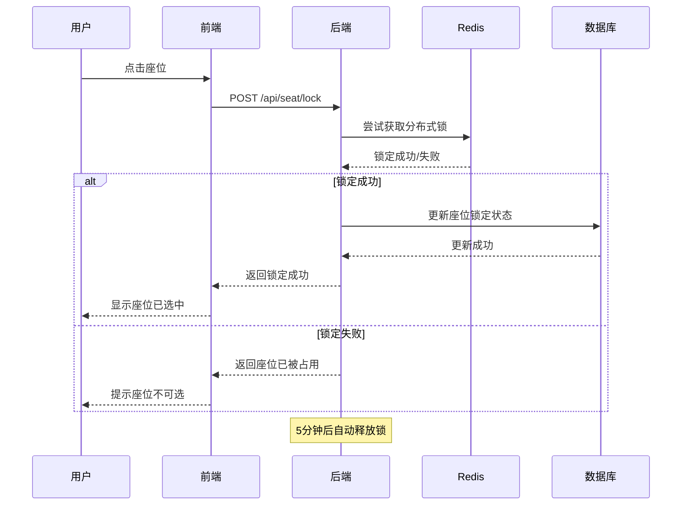

# 网咖选座功能实现方案

## 项目概述

本文档详细描述了网咖票务系统选座功能的完整实现方案，包括数据库设计、后端API、前端界面以及高并发处理策略。

---

## 1. 需求分析

### 1.1 业务需求
- 用户在演出列表页(`/show/list`)点击机位后进入选座界面
- 不同等级机位对应不同的座位区域访问权限
- 支持三层楼的座位布局
- 需要处理100人同时预约的高并发场景

### 1.2 权限等级与机位映射关系

| 权限等级 | 包含的机位类型 | Type | 可选座位区域 | 价格 |
|---------|---------------|------|-------------|------|
| **普通权限** | 新客电竞机位<br/>初级电竞机位 | 1<br/>2 | 一楼大厅、随机区、特惠专区 | ¥10/小时<br/>¥20/小时 |
| **VIP权限** | 中级电竞机位<br/>高级电竞机位<br/>包厢电竞机位 | 3<br/>4<br/>5 | 2-4楼大厅、2-4楼包厢区域 | ¥30/小时<br/>¥50/小时<br/>包厢价格 |
| **SVIP权限** | SVIP电竞机位 | 6 | 除包场外的所有区域(含SVIP专区) | ¥100/小时 |

### 1.3 座位布局规划

| 楼层/区域 | 座位数量 | 说明 | 权限要求 |
|----------|---------|------|---------|
| 一楼大厅 | 30个 | 普通电竞座位 | 普通权限 |
| 一楼随机区 | 20个 | 随机分配座位 | 普通权限 |
| 一楼特惠专区 | 15个 | 特价优惠座位 | 普通权限 |
| 二楼大厅 | 30个 | VIP电竞座位 | VIP权限 |
| 二楼包厢区 | 25个 | 5个独立包厢，每包厢5座 | VIP权限 |
| 二楼SVIP专区 | 10个 | 顶级配置座位 | SVIP权限 |
| 三楼大厅 | 30个 | VIP电竞座位 | VIP权限 |
| 三楼包厢区 | 25个 | 5个独立包厢，每包厢5座 | VIP权限 |
| 四楼大厅 | 30个 | VIP电竞座位 | VIP权限 |
| 四楼包厢区 | 25个 | 5个独立包厢，每包厢5座 | VIP权限 |
| 包场选项 | 4个 | 1-4层整层包场 | SVIP权限 |

**总座位数量**：240个座位 + 4个包场选项

### 1.4 定价策略

#### 1.4.1 基础价格
- **新客电竞机位**：¥10/小时
- **初级电竞机位**：¥20/小时  
- **中级电竞机位**：¥30/小时
- **高级电竞机位**：¥50/小时
- **包厢电竞机位**：¥50/小时（独立包厢）
- **SVIP电竞机位**：¥100/小时
- **包场服务**：¥2500/次

#### 1.4.2 分时段定价
- **日间时段**（00:00-23:59）：基础价格
- **深夜时段**（00:00-05:59）：基础价格 + ¥3/小时

### 1.5 预约规则

#### 1.5.1 时长限制
- **最短预约时长**：2小时
- **最长预约时长**：8小时
- **提前预约**：最早支持72小时（3天）前预约

#### 1.5.2 座位锁定
- **锁定时长**：5分钟（用户选座后的保留时间）
- **锁定机制**：Redis分布式锁 + 数据库乐观锁

---

## 2. 数据库设计方案

### 2.1 当前表结构分析

**现有问题**：
- `t_seat_area` 表缺少楼层信息和区域类型字段
- `t_seat` 表缺少座位坐标和状态细分
- 缺少机位类型与座位区域的权限映射关系
- 缺少高并发座位锁定机制

### 2.2 新增/修改表结构

#### 2.2.1 修改 `t_seat_area` 表
```sql
ALTER TABLE t_seat_area 
ADD COLUMN floor_level TINYINT NOT NULL DEFAULT 1 COMMENT '楼层：1-4楼',
ADD COLUMN area_type VARCHAR(20) NOT NULL DEFAULT 'HALL' COMMENT '区域类型：HALL-大厅，VIP_ROOM-包厢，SVIP-SVIP区，CHARTER-包场',
ADD COLUMN area_code VARCHAR(50) NOT NULL COMMENT '区域编码：如F1_HALL, F2_VIP_01',
ADD COLUMN show_type_access VARCHAR(50) COMMENT '允许访问的机位类型，逗号分隔：1,2,3',
ADD COLUMN x_position INT DEFAULT 0 COMMENT 'X坐标位置',
ADD COLUMN y_position INT DEFAULT 0 COMMENT 'Y坐标位置',
ADD COLUMN max_seats INT NOT NULL DEFAULT 30 COMMENT '最大座位数',
ADD COLUMN night_price_addon DECIMAL(10,2) NOT NULL DEFAULT 3.00 COMMENT '深夜时段加价（00:00-05:59）';

-- 添加索引
CREATE INDEX idx_seat_area_floor ON t_seat_area(floor_level);
CREATE INDEX idx_seat_area_type ON t_seat_area(area_type);
CREATE INDEX idx_seat_area_code ON t_seat_area(area_code);
```

#### 2.2.2 修改 `t_seat` 表
```sql
ALTER TABLE t_seat 
ADD COLUMN seat_code VARCHAR(20) NOT NULL COMMENT '座位编码：如F1_H_A01',
ADD COLUMN x_coordinate INT NOT NULL DEFAULT 0 COMMENT 'X坐标',
ADD COLUMN y_coordinate INT NOT NULL DEFAULT 0 COMMENT 'Y坐标',
ADD COLUMN seat_type TINYINT NOT NULL DEFAULT 1 COMMENT '座位类型：1-普通，2-VIP，3-SVIP',
ADD COLUMN lock_status TINYINT NOT NULL DEFAULT 0 COMMENT '锁定状态：0-空闲，1-已锁定，2-已占用',
ADD COLUMN lock_time TIMESTAMP NULL COMMENT '锁定时间',
ADD COLUMN lock_user_id BIGINT NULL COMMENT '锁定用户ID',
ADD COLUMN lock_expire_time TIMESTAMP NULL COMMENT '锁定过期时间';

-- 修改现有status字段注释
ALTER TABLE t_seat MODIFY COLUMN status TINYINT NOT NULL DEFAULT 1 COMMENT '座位状态：0-维护中，1-可用';

-- 添加索引
CREATE INDEX idx_seat_code ON t_seat(seat_code);
CREATE INDEX idx_seat_coordinates ON t_seat(x_coordinate, y_coordinate);
CREATE INDEX idx_seat_lock_status ON t_seat(lock_status);
CREATE INDEX idx_seat_lock_expire ON t_seat(lock_expire_time);
```

#### 2.2.3 新增 `t_seat_layout` 表（座位布局配置）
```sql
CREATE TABLE t_seat_layout (
    id BIGINT PRIMARY KEY AUTO_INCREMENT,
    area_id BIGINT NOT NULL COMMENT '座位区域ID',
    layout_name VARCHAR(100) NOT NULL COMMENT '布局名称',
    layout_config JSON NOT NULL COMMENT '布局配置JSON',
    total_rows INT NOT NULL COMMENT '总行数',
    total_cols INT NOT NULL COMMENT '总列数',
    create_time DATETIME NOT NULL DEFAULT CURRENT_TIMESTAMP,
    update_time DATETIME NOT NULL DEFAULT CURRENT_TIMESTAMP ON UPDATE CURRENT_TIMESTAMP,
    is_deleted TINYINT NOT NULL DEFAULT 0,
    FOREIGN KEY (area_id) REFERENCES t_seat_area(id),
    INDEX idx_layout_area(area_id)
) COMMENT '座位布局配置表';
```

### 2.3 初始化数据脚本

```sql
-- 清理现有数据
DELETE FROM t_seat;
DELETE FROM t_seat_area;

-- 插入座位区域数据
INSERT INTO t_seat_area (venue_id, name, area_code, floor_level, area_type, show_type_access, price, capacity, max_seats) VALUES
-- 一楼区域（普通权限：新客机位Type1 ¥10/h，初级机位Type2 ¥20/h）
(1, '一楼大厅', 'F1_HALL', 1, 'HALL', '1,2', 10.00, 30, 30),
(1, '随机区', 'F1_RANDOM', 1, 'HALL', '1,2', 15.00, 20, 20),
(1, '特惠专区', 'F1_SPECIAL', 1, 'HALL', '1,2', 8.00, 15, 15),

-- 二楼区域  
(1, '二楼大厅', 'F2_HALL', 2, 'HALL', '3,4,5', 30.00, 30, 30),
(1, '二楼包厢区', 'F2_VIP', 2, 'VIP_ROOM', '3,4,5', 50.00, 25, 25),
(1, 'SVIP专区', 'F2_SVIP', 2, 'SVIP', '6', 100.00, 10, 10),

-- 三楼区域
(1, '三楼大厅', 'F3_HALL', 3, 'HALL', '3,4,5', 30.00, 30, 30),
(1, '三楼包厢区', 'F3_VIP', 3, 'VIP_ROOM', '3,4,5', 50.00, 25, 25),

-- 四楼区域
(1, '四楼大厅', 'F4_HALL', 4, 'HALL', '3,4,5', 30.00, 30, 30),
(1, '四楼包厢区', 'F4_VIP', 4, 'VIP_ROOM', '3,4,5', 50.00, 25, 25),

-- 包场选项（SVIP权限）
(1, '一楼包场', 'F1_CHARTER', 1, 'CHARTER', '6', 2500.00, 1, 1),
(1, '二楼包场', 'F2_CHARTER', 2, 'CHARTER', '6', 2500.00, 1, 1),
(1, '三楼包场', 'F3_CHARTER', 3, 'CHARTER', '6', 2500.00, 1, 1),
(1, '四楼包场', 'F4_CHARTER', 4, 'CHARTER', '6', 2500.00, 1, 1);

-- 更新演出表的机位数据（新增第6种机位类型）
UPDATE t_show SET name = '新客电竞机位', min_price = 10.00, max_price = 13.00 WHERE id = 1 AND type = 1;
UPDATE t_show SET name = '初级电竞机位', type = 2, min_price = 20.00, max_price = 23.00 WHERE id = 2;
INSERT INTO t_show (name, type, poster_url, description, venue, city, start_time, end_time, min_price, max_price, status, is_hot, is_recommend) VALUES
('中级电竞机位', 3, '/images/seat_intermediate.svg', '中级电竞机位，适合有一定经验的玩家', '网咖一号店', '北京市', '2024-01-01 00:00:00', '2024-12-31 23:59:59', 30.00, 33.00, 1, 0, 1),
('高级电竞机位', 4, '/images/seat_advanced.svg', '高级电竞机位，专业级配置', '网咖一号店', '北京市', '2024-01-01 00:00:00', '2024-12-31 23:59:59', 50.00, 53.00, 1, 1, 1),
('包厢电竞机位', 5, '/images/seat_vip_room.svg', '独立包厢，私密空间', '网咖一号店', '北京市', '2024-01-01 00:00:00', '2024-12-31 23:59:59', 50.00, 53.00, 1, 1, 1),
('SVIP电竞机位', 6, '/images/seat_svip.svg', '顶级配置，至尊体验', '网咖一号店', '北京市', '2024-01-01 00:00:00', '2024-12-31 23:59:59', 100.00, 103.00, 1, 1, 1);
```

---

## 3. 高并发座位锁定策略

### 3.1 分布式锁机制

#### 3.1.1 Redis分布式锁
```java
@Component
public class SeatLockService {
    
    @Autowired
    private RedisTemplate<String, String> redisTemplate;
    
    private static final String SEAT_LOCK_PREFIX = "seat_lock:";
    private static final int LOCK_EXPIRE_TIME = 300; // 5分钟
    
    /**
     * 尝试锁定座位
     */
    public boolean tryLockSeat(Long seatId, Long userId) {
        String lockKey = SEAT_LOCK_PREFIX + seatId;
        String lockValue = userId + ":" + System.currentTimeMillis();
        
        Boolean success = redisTemplate.opsForValue()
            .setIfAbsent(lockKey, lockValue, Duration.ofSeconds(LOCK_EXPIRE_TIME));
            
        if (success) {
            // 同时更新数据库座位锁定状态
            updateSeatLockStatus(seatId, userId);
        }
        
        return success;
    }
    
    /**
     * 释放座位锁
     */
    public void releaseSeatLock(Long seatId, Long userId) {
        String lockKey = SEAT_LOCK_PREFIX + seatId;
        // Lua脚本确保原子性
        String script = "if redis.call('get', KEYS[1]) == ARGV[1] then " +
                       "return redis.call('del', KEYS[1]) else return 0 end";
        
        redisTemplate.execute(new DefaultRedisScript<>(script, Long.class),
            Arrays.asList(lockKey), userId.toString());
            
        // 更新数据库状态
        clearSeatLockStatus(seatId);
    }
}
```

#### 3.1.2 数据库乐观锁
```java
@Mapper
public interface SeatMapper {
    
    @Update("UPDATE t_seat SET lock_status = 1, lock_user_id = #{userId}, " +
            "lock_time = NOW(), lock_expire_time = DATE_ADD(NOW(), INTERVAL 5 MINUTE) " +
            "WHERE id = #{seatId} AND lock_status = 0")
    int lockSeat(@Param("seatId") Long seatId, @Param("userId") Long userId);
    
    @Update("UPDATE t_seat SET lock_status = 0, lock_user_id = NULL, " +
            "lock_time = NULL, lock_expire_time = NULL " +
            "WHERE id = #{seatId} AND lock_user_id = #{userId}")
    int releaseSeat(@Param("seatId") Long seatId, @Param("userId") Long userId);
}
```

### 3.2 座位选择流程



---

## 4. 后端API设计

### 4.1 座位相关API接口

#### 4.1.1 获取座位区域列表
```java
@GetMapping("/api/seat/areas")
@Operation(summary = "根据机位类型获取可选座位区域")
public Result<List<SeatAreaVO>> getSeatAreas(
    @RequestParam Integer showType,
    @RequestParam Long showId) {
    
    List<SeatAreaVO> areas = seatService.getAvailableAreas(showType, showId);
    return Result.success(areas);
}
```

#### 4.1.2 获取区域座位布局
```java
@GetMapping("/api/seat/layout/{areaId}")
@Operation(summary = "获取座位区域的布局信息")
public Result<SeatLayoutVO> getSeatLayout(
    @PathVariable Long areaId,
    @RequestParam Long showId,
    @RequestParam Long sessionId) {
    
    SeatLayoutVO layout = seatService.getSeatLayout(areaId, showId, sessionId);
    return Result.success(layout);
}
```

#### 4.1.3 锁定座位
```java
@PostMapping("/api/seat/lock")
@Operation(summary = "锁定选中的座位")
public Result<Boolean> lockSeats(
    @RequestBody SeatLockRequest request,
    HttpServletRequest httpRequest) {
    
    String userIdHeader = httpRequest.getHeader("X-User-Id");
    Long userId = Long.valueOf(userIdHeader);
    
    boolean success = seatService.lockSeats(request.getSeatIds(), userId);
    return Result.success(success);
}
```

#### 4.1.4 释放座位锁定
```java
@PostMapping("/api/seat/release")
@Operation(summary = "释放座位锁定")
public Result<Boolean> releaseSeats(
    @RequestBody SeatReleaseRequest request,
    HttpServletRequest httpRequest) {
    
    String userIdHeader = httpRequest.getHeader("X-User-Id");
    Long userId = Long.valueOf(userIdHeader);
    
    boolean success = seatService.releaseSeats(request.getSeatIds(), userId);
    return Result.success(success);
}
```

### 4.2 VO类设计

```java
@Data
public class SeatAreaVO {
    private Long id;
    private String name;
    private String areaCode;
    private Integer floorLevel;
    private String areaType;
    private BigDecimal price;
    private Integer totalSeats;
    private Integer availableSeats;
    private String description;
}

@Data
public class SeatLayoutVO {
    private Long areaId;
    private String areaName;
    private Integer totalRows;
    private Integer totalCols;
    private List<SeatVO> seats;
    private String layoutConfig;
}

@Data
public class SeatVO {
    private Long id;
    private String seatCode;
    private String rowNum;
    private String seatNum;
    private Integer xCoordinate;
    private Integer yCoordinate;
    private Integer status; // 0-维护，1-可选，2-已锁定，3-已占用
    private Integer seatType;
    private BigDecimal price;
    private Long lockUserId; // 当前锁定用户（前端用于判断是否为当前用户锁定）
}
```

---

## 5. 前端实现方案

### 5.1 路由配置

```typescript
// router/index.ts
{
  path: '/seat',
  component: Layout,
  meta: { hidden: true },
  children: [
    {
      path: 'selection/:showId/:sessionId',
      component: () => import('@/views/seat/selection.vue'),
      name: 'SeatSelection',
      meta: { title: '选择座位', hidden: true }
    }
  ]
}
```

### 5.2 选座页面组件设计

#### 5.2.1 主选座组件 (`/views/seat/selection.vue`)

```vue
<template>
  <div class="seat-selection-container">
    <!-- 顶部信息栏 -->
    <div class="show-info-header">
      <div class="show-details">
        <h2>{{ showInfo.name }}</h2>
        <p>{{ showInfo.venue }} | {{ formatDate(sessionInfo.startTime) }}</p>
      </div>
      <div class="selected-info">
        <span>已选座位: {{ selectedSeats.length }}</span>
        <span>总价: ¥{{ totalPrice }}</span>
      </div>
    </div>

    <!-- 楼层选择 -->
    <div class="floor-selector">
      <el-radio-group v-model="currentFloor" @change="handleFloorChange">
        <el-radio-button 
          v-for="floor in availableFloors" 
          :key="floor.level"
          :label="floor.level">
          {{ floor.name }}
        </el-radio-button>
      </el-radio-group>
    </div>

    <!-- 座位区域选择 -->
    <div class="area-selector">
      <el-select v-model="currentAreaId" @change="handleAreaChange" placeholder="选择区域">
        <el-option
          v-for="area in currentFloorAreas"
          :key="area.id"
          :label="area.name"
          :value="area.id">
          <span>{{ area.name }}</span>
          <span style="float: right; color: #8492a6;">¥{{ area.price }}/小时</span>
        </el-option>
      </el-select>
    </div>

    <!-- 座位布局图 -->
    <div class="seat-layout-container">
      <SeatMap 
        :layout="currentLayout"
        :selected-seats="selectedSeats"
        @seat-click="handleSeatClick"
        @seat-hover="handleSeatHover"
      />
    </div>

    <!-- 图例 -->
    <div class="seat-legend">
      <div class="legend-item">
        <div class="seat-icon available"></div>
        <span>可选</span>
      </div>
      <div class="legend-item">
        <div class="seat-icon selected"></div>
        <span>已选</span>
      </div>
      <div class="legend-item">
        <div class="seat-icon occupied"></div>
        <span>已占用</span>
      </div>
      <div class="legend-item">
        <div class="seat-icon maintenance"></div>
        <span>维护中</span>
      </div>
    </div>

    <!-- 底部操作栏 -->
    <div class="bottom-actions">
      <el-button @click="clearSelection">清空选择</el-button>
      <el-button 
        type="primary" 
        @click="confirmSelection"
        :disabled="selectedSeats.length === 0">
        确认选座 ({{ selectedSeats.length }})
      </el-button>
    </div>
  </div>
</template>

<script setup>
import { ref, reactive, computed, onMounted, onUnmounted } from 'vue'
import { useRoute, useRouter } from 'vue-router'
import { ElMessage } from 'element-plus'
import SeatMap from '@/components/SeatMap.vue'
import { getSeatAreas, getSeatLayout, lockSeats, releaseSeats } from '@/api/seat'
import { getShowDetail } from '@/api/show'

const route = useRoute()
const router = useRouter()

// 响应式数据
const showInfo = ref({})
const sessionInfo = ref({})
const availableFloors = ref([])
const currentFloor = ref(1)
const currentAreaId = ref(null)
const currentLayout = ref({})
const selectedSeats = ref([])
const lockTimer = ref(null)

// 计算属性
const currentFloorAreas = computed(() => {
  return availableFloors.value.find(f => f.level === currentFloor.value)?.areas || []
})

const totalPrice = computed(() => {
  return selectedSeats.value.reduce((sum, seat) => sum + seat.price, 0)
})

// 生命周期
onMounted(() => {
  initializeData()
  startLockRefreshTimer()
})

onUnmounted(() => {
  clearLockTimer()
  releaseAllSeats()
})

// 方法
const initializeData = async () => {
  try {
    const showId = route.params.showId
    const sessionId = route.params.sessionId
    
    // 获取演出信息
    const showResponse = await getShowDetail(showId)
    showInfo.value = showResponse.data
    
    // 获取可用座位区域
    const areasResponse = await getSeatAreas(showInfo.value.type, showId)
    processAreasData(areasResponse.data)
    
    // 默认选择第一个楼层和区域
    if (availableFloors.value.length > 0) {
      currentFloor.value = availableFloors.value[0].level
      if (currentFloorAreas.value.length > 0) {
        currentAreaId.value = currentFloorAreas.value[0].id
        await loadSeatLayout()
      }
    }
  } catch (error) {
    ElMessage.error('加载座位信息失败')
  }
}

const processAreasData = (areas) => {
  // 按楼层分组座位区域
  const floorMap = new Map()
  
  areas.forEach(area => {
    if (!floorMap.has(area.floorLevel)) {
      floorMap.set(area.floorLevel, {
        level: area.floorLevel,
        name: `${area.floorLevel}楼`,
        areas: []
      })
    }
    floorMap.get(area.floorLevel).areas.push(area)
  })
  
  availableFloors.value = Array.from(floorMap.values()).sort((a, b) => a.level - b.level)
}

const handleFloorChange = () => {
  if (currentFloorAreas.value.length > 0) {
    currentAreaId.value = currentFloorAreas.value[0].id
    loadSeatLayout()
  }
}

const handleAreaChange = () => {
  loadSeatLayout()
}

const loadSeatLayout = async () => {
  try {
    const response = await getSeatLayout(
      currentAreaId.value, 
      route.params.showId, 
      route.params.sessionId
    )
    currentLayout.value = response.data
  } catch (error) {
    ElMessage.error('加载座位布局失败')
  }
}

const handleSeatClick = async (seat) => {
  if (seat.status === 0 || seat.status === 3) {
    ElMessage.warning('该座位不可选择')
    return
  }
  
  const isSelected = selectedSeats.value.some(s => s.id === seat.id)
  
  if (isSelected) {
    // 取消选择
    await releaseSeatLock(seat)
    selectedSeats.value = selectedSeats.value.filter(s => s.id !== seat.id)
  } else {
    // 选择座位
    try {
      const success = await lockSeats([seat.id])
      if (success) {
        selectedSeats.value.push(seat)
        seat.status = 2 // 更新为已锁定状态
      } else {
        ElMessage.warning('座位已被其他用户选择')
      }
    } catch (error) {
      ElMessage.error('选择座位失败')
    }
  }
}

const confirmSelection = () => {
  if (selectedSeats.value.length === 0) {
    ElMessage.warning('请先选择座位')
    return
  }
  
  // 跳转到订单确认页面
  router.push({
    name: 'BookingDetail',
    params: {
      showId: route.params.showId,
      sessionId: route.params.sessionId
    },
    query: {
      seatIds: selectedSeats.value.map(s => s.id).join(',')
    }
  })
}

const startLockRefreshTimer = () => {
  // 每4分钟刷新一次锁定状态
  lockTimer.value = setInterval(() => {
    refreshSeatLocks()
  }, 240000)
}

const refreshSeatLocks = async () => {
  if (selectedSeats.value.length > 0) {
    const seatIds = selectedSeats.value.map(s => s.id)
    try {
      await lockSeats(seatIds) // 续期锁定
    } catch (error) {
      console.error('刷新座位锁定失败:', error)
    }
  }
}

const clearLockTimer = () => {
  if (lockTimer.value) {
    clearInterval(lockTimer.value)
    lockTimer.value = null
  }
}

const releaseAllSeats = async () => {
  if (selectedSeats.value.length > 0) {
    const seatIds = selectedSeats.value.map(s => s.id)
    try {
      await releaseSeats(seatIds)
    } catch (error) {
      console.error('释放座位锁定失败:', error)
    }
  }
}
</script>

<style scoped>
.seat-selection-container {
  padding: 20px;
  min-height: 100vh;
  background: var(--ai-gradient-bg);
}

.show-info-header {
  display: flex;
  justify-content: space-between;
  align-items: center;
  padding: 20px;
  background: var(--ai-gradient-card);
  border-radius: 12px;
  margin-bottom: 20px;
}

.floor-selector, .area-selector {
  margin-bottom: 20px;
  text-align: center;
}

.seat-layout-container {
  background: white;
  border-radius: 12px;
  padding: 20px;
  margin-bottom: 20px;
  min-height: 400px;
}

.seat-legend {
  display: flex;
  justify-content: center;
  gap: 30px;
  margin-bottom: 20px;
}

.legend-item {
  display: flex;
  align-items: center;
  gap: 8px;
}

.seat-icon {
  width: 20px;
  height: 20px;
  border-radius: 4px;
}

.seat-icon.available { background: #67C23A; }
.seat-icon.selected { background: #409EFF; }
.seat-icon.occupied { background: #F56C6C; }
.seat-icon.maintenance { background: #909399; }

.bottom-actions {
  position: fixed;
  bottom: 0;
  left: 0;
  right: 0;
  padding: 20px;
  background: white;
  border-top: 1px solid #ebeef5;
  display: flex;
  justify-content: space-between;
}
</style>
```

#### 5.2.2 座位地图组件 (`/components/SeatMap.vue`)

```vue
<template>
  <div class="seat-map-container">
    <div class="seat-grid" :style="gridStyle">
      <div
        v-for="seat in layout.seats"
        :key="seat.id"
        class="seat-item"
        :class="getSeatClass(seat)"
        :style="getSeatStyle(seat)"
        @click="handleSeatClick(seat)"
        @mouseenter="$emit('seat-hover', seat)"
        :title="getSeatTooltip(seat)">
        {{ seat.seatNum }}
      </div>
    </div>
  </div>
</template>

<script setup>
import { computed } from 'vue'

const props = defineProps({
  layout: {
    type: Object,
    default: () => ({})
  },
  selectedSeats: {
    type: Array,
    default: () => []
  }
})

const emit = defineEmits(['seat-click', 'seat-hover'])

const gridStyle = computed(() => {
  if (!props.layout.totalCols) return {}
  
  return {
    gridTemplateColumns: `repeat(${props.layout.totalCols}, 1fr)`,
    gap: '8px'
  }
})

const getSeatClass = (seat) => {
  const classes = ['seat']
  
  switch (seat.status) {
    case 0:
      classes.push('maintenance')
      break
    case 1:
      classes.push('available')
      break
    case 2:
      classes.push('locked')
      break
    case 3:
      classes.push('occupied')
      break
  }
  
  if (props.selectedSeats.some(s => s.id === seat.id)) {
    classes.push('selected')
  }
  
  return classes
}

const getSeatStyle = (seat) => {
  return {
    gridColumn: seat.xCoordinate + 1,
    gridRow: seat.yCoordinate + 1
  }
}

const getSeatTooltip = (seat) => {
  return `${seat.seatCode} - ¥${seat.price}/小时`
}

const handleSeatClick = (seat) => {
  emit('seat-click', seat)
}
</script>

<style scoped>
.seat-map-container {
  width: 100%;
  height: 100%;
  overflow: auto;
}

.seat-grid {
  display: grid;
  justify-content: center;
  padding: 20px;
  min-width: 600px;
}

.seat-item {
  width: 40px;
  height: 40px;
  border-radius: 8px;
  display: flex;
  align-items: center;
  justify-content: center;
  font-size: 12px;
  font-weight: bold;
  cursor: pointer;
  transition: all 0.3s ease;
  border: 2px solid transparent;
}

.seat-item:hover {
  transform: scale(1.1);
  box-shadow: 0 4px 12px rgba(0, 0, 0, 0.2);
}

.seat-item.available {
  background: #67C23A;
  color: white;
}

.seat-item.available:hover {
  background: #85CE61;
}

.seat-item.selected {
  background: #409EFF;
  color: white;
  border-color: #1890ff;
}

.seat-item.locked {
  background: #E6A23C;
  color: white;
  cursor: not-allowed;
}

.seat-item.occupied {
  background: #F56C6C;
  color: white;
  cursor: not-allowed;
}

.seat-item.maintenance {
  background: #909399;
  color: white;
  cursor: not-allowed;
}
</style>
```

### 5.3 前端API接口

```typescript
// api/seat.ts
import request from '@/utils/request'

export interface SeatArea {
  id: number
  name: string
  areaCode: string
  floorLevel: number
  areaType: string
  price: number
  totalSeats: number
  availableSeats: number
}

export interface SeatLayout {
  areaId: number
  areaName: string
  totalRows: number
  totalCols: number
  seats: Seat[]
}

export interface Seat {
  id: number
  seatCode: string
  rowNum: string
  seatNum: string
  xCoordinate: number
  yCoordinate: number
  status: number
  seatType: number
  price: number
  lockUserId?: number
}

// 获取座位区域
export function getSeatAreas(showType: number, showId: number): Promise<ApiResponse<SeatArea[]>> {
  return request({
    url: '/seat/areas',
    method: 'get',
    params: { showType, showId }
  })
}

// 获取座位布局
export function getSeatLayout(areaId: number, showId: number, sessionId: number): Promise<ApiResponse<SeatLayout>> {
  return request({
    url: `/seat/layout/${areaId}`,
    method: 'get',
    params: { showId, sessionId }
  })
}

// 锁定座位
export function lockSeats(seatIds: number[]): Promise<ApiResponse<boolean>> {
  return request({
    url: '/seat/lock',
    method: 'post',
    data: { seatIds }
  })
}

// 释放座位
export function releaseSeats(seatIds: number[]): Promise<ApiResponse<boolean>> {
  return request({
    url: '/seat/release',
    method: 'post',
    data: { seatIds }
  })
}
```

---

## 6. 实现步骤

### 6.1 数据库修改（第一阶段）
1. 执行数据库表结构修改SQL
2. 运行座位区域和座位数据初始化脚本
3. 验证数据完整性

### 6.2 后端开发（第二阶段）
1. 创建座位相关的Entity、VO、Service类
2. 实现座位锁定的Redis分布式锁机制
3. 开发座位查询、锁定、释放的API接口
4. 编写单元测试和集成测试

### 6.3 前端开发（第三阶段）
1. 创建选座页面路由和组件
2. 实现座位地图可视化组件
3. 集成座位选择和锁定逻辑
4. 优化用户体验和异常处理

### 6.4 集成测试（第四阶段）
1. 端到端功能测试
2. 高并发压力测试
3. 座位锁定机制验证
4. 用户体验优化

---

## 7. 性能优化与监控

### 7.1 缓存策略
- Redis缓存座位状态信息
- 座位布局配置缓存
- 用户选座状态缓存

### 7.2 数据库优化
- 座位查询索引优化
- 读写分离
- 连接池配置优化

### 7.3 前端优化
- 座位地图虚拟滚动
- 组件懒加载
- WebSocket实时状态更新

### 7.4 监控指标
- 座位锁定成功率
- 页面加载时间
- 并发用户数
- 数据库查询性能

---

## 8. 风险评估与应对

### 8.1 技术风险
- **高并发座位冲突**: 通过Redis分布式锁和数据库乐观锁双重保障
- **系统性能瓶颈**: 引入缓存和读写分离
- **前端渲染性能**: 使用虚拟滚动和组件优化

### 8.2 业务风险
- **用户体验**: 提供清晰的座位状态反馈和操作指引
- **数据一致性**: 定时清理过期锁定，确保座位状态准确
- **扩展性**: 模块化设计，便于后续功能扩展

---

## 9. 总结

本方案提供了完整的网咖选座功能实现方案，涵盖了：

1. **完整的数据库设计**：支持多楼层、多区域的座位管理
2. **高并发处理机制**：Redis分布式锁 + 数据库乐观锁
3. **现代化的前端界面**：Vue3 + Element Plus的响应式设计
4. **完善的API接口**：RESTful设计，支持各种座位操作
5. **性能优化策略**：缓存、索引、前端优化等多重保障

该方案能够有效支撑100人同时预约的高并发场景，同时提供良好的用户体验和系统稳定性。

<function_calls>
<invoke name="todo_write">
<parameter name="merge">true