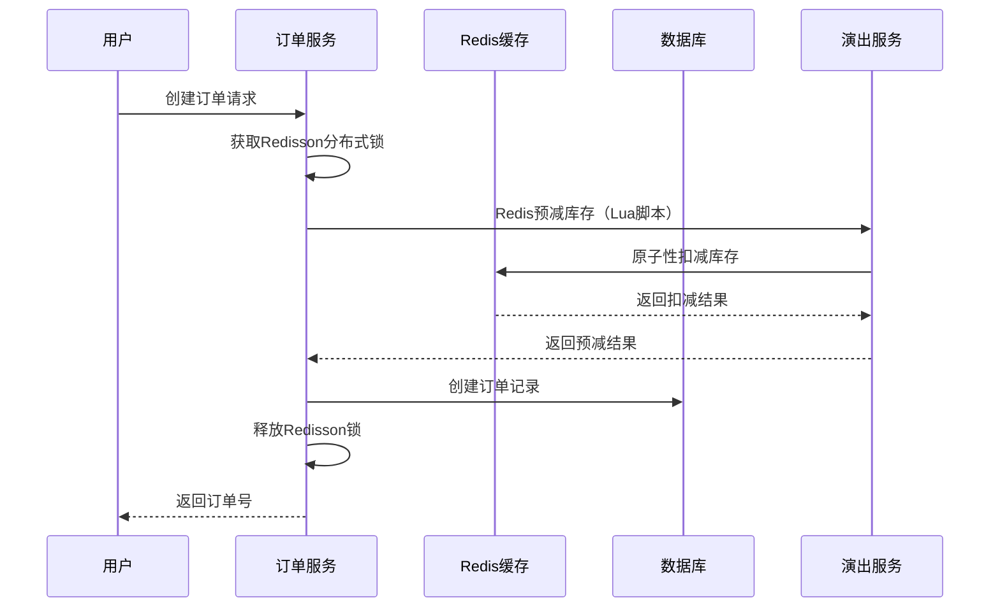
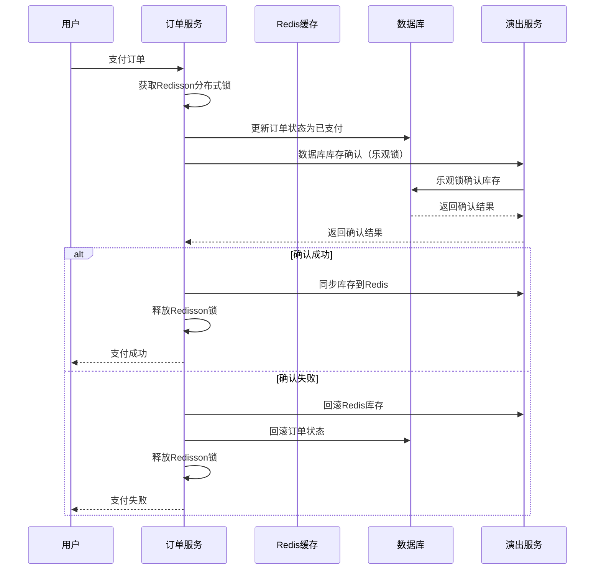
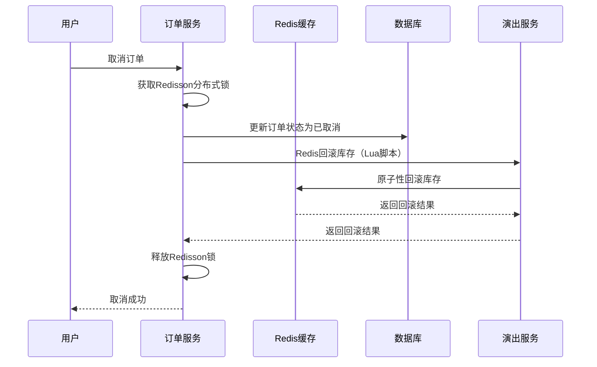

# 锁使用顺序优化方案

## 当前锁机制分析

### 1. 现有锁类型
- **Redisson分布式锁**: 用于订单创建和支付流程的并发控制
- **Redis+Lua脚本锁**: 用于座位锁定和库存预减的原子操作
- **数据库乐观锁**: 用于库存的最终确认和状态更新

### 2. 锁冲突问题
- Redis预减库存与数据库乐观锁版本号不同步
- 支付确认时缺少数据库乐观锁确认步骤
- 数据一致性检查和补偿机制不完善

## 优化后的锁使用顺序

### 1. 订单创建流程（已优化）



### 2. 支付确认流程（已修复）



### 3. 订单取消流程（已优化）



## 锁使用原则

### 1. 锁的层次结构
```
Redisson分布式锁 (应用层)
    ↓
Redis+Lua脚本锁 (缓存层)
    ↓
数据库乐观锁 (持久层)
```

### 2. 锁的获取顺序
1. **先获取应用层锁** (Redisson分布式锁)
2. **再执行缓存层操作** (Redis+Lua脚本)
3. **最后执行数据库操作** (乐观锁)

### 3. 锁的释放顺序
1. **先释放数据库锁** (自动释放)
2. **再释放缓存层锁** (Lua脚本自动释放)
3. **最后释放应用层锁** (Redisson锁)

## 数据一致性保障

### 1. 一致性检查机制
- 定期检查Redis与数据库库存一致性
- 提供手动修复接口
- 记录不一致的详细日志

### 2. 补偿机制
- 支付失败时自动回滚Redis库存
- 数据库确认失败时回滚订单状态
- 提供数据修复工具

### 3. 监控告警
- 监控锁获取失败率
- 监控数据一致性状态
- 监控库存操作异常

## 性能优化建议

### 1. 锁粒度优化
- 使用票档ID作为锁的粒度
- 避免全局锁的使用
- 合理设置锁的过期时间

### 2. 重试机制
- 乐观锁冲突时自动重试
- 设置合理的重试次数和间隔
- 避免无限重试

### 3. 异步处理
- 非关键操作异步执行
- 使用消息队列处理补偿操作
- 减少同步等待时间

## 实施检查清单

### 1. 代码修复 ✅
- [x] 添加数据库库存确认接口
- [x] 修复支付确认流程
- [x] 添加数据一致性检查服务
- [x] 完善错误处理和回滚机制

### 2. 测试验证 ⏳
- [ ] 单元测试覆盖
- [ ] 集成测试验证
- [ ] 压力测试验证
- [ ] 数据一致性测试

### 3. 监控部署 ⏳
- [ ] 添加监控指标
- [ ] 配置告警规则
- [ ] 部署到生产环境
- [ ] 验证运行效果

## 风险评估

### 低风险
- 添加新的接口和服务
- 完善错误处理逻辑
- 增加监控和日志

### 中等风险
- 修改支付确认流程
- 添加数据库确认步骤
- 可能影响支付性能

### 高风险
- 数据一致性修复
- 需要充分测试验证
- 可能影响业务连续性

## 总结

通过本次优化，主要解决了：
1. **锁冲突问题** - 明确了锁的使用顺序和层次
2. **数据一致性问题** - 添加了数据库确认和补偿机制
3. **监控和运维** - 提供了数据一致性检查和修复工具

建议按照检查清单逐步实施，确保系统稳定运行。