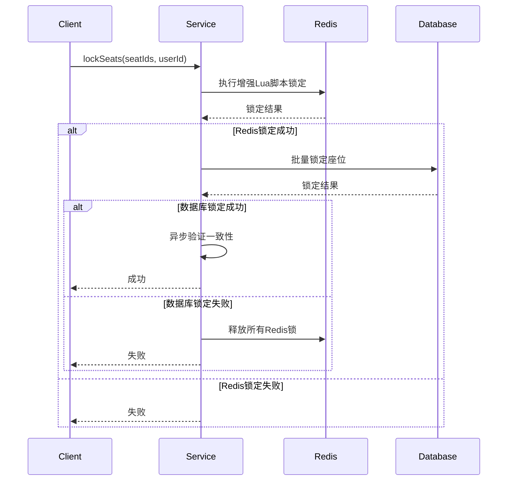

# Seat Lock 数据一致性保障方案

## 概述

本方案解决了 `seat_lock:*` 相关键在 Redisson 中的数据一致性问题，通过统一的数据一致性保障机制，确保 Redis 分布式锁与数据库座位状态的强一致性。

## 核心组件

### 1. SeatConsistencyService

**位置**: `com.ticketsystem.show.service.impl.SeatConsistencyService`

**功能**:
- 原子性座位锁定和释放
- Redis 与数据库双重保障
- 数据一致性验证和修复
- 过期锁定自动清理

**核心方法**:
```java
// 原子性锁定座位
boolean atomicLockSeats(List<Long> seatIds, Long userId)

// 原子性释放座位
boolean atomicReleaseSeats(List<Long> seatIds, Long userId)

// 验证并修复数据一致性
void verifyAndRepairConsistency(Long seatId, Long userId)

// 清理过期锁定
void cleanupExpiredLocks()
```

### 2. SeatConsistencyScheduler

**位置**: `com.ticketsystem.show.config.SeatConsistencyScheduler`

**功能**:
- 定时清理过期锁定（每分钟）
- 数据一致性健康检查（每5分钟）
- 系统状态报告（每小时）

### 3. SeatConsistencyController

**位置**: `com.ticketsystem.show.controller.SeatConsistencyController`

**功能**:
- 座位锁定状态查询
- 手动触发一致性验证
- 系统健康状态监控

## Redis 键设计

### 座位锁定键
```
seat_lock:{seatId}
```
- **值格式**: `{userId}:{timestamp}`
- **过期时间**: 300秒（5分钟）
- **用途**: 标记座位被特定用户锁定

### 同步标记键
```
seat_sync:{seatId}
```
- **值格式**: `{timestamp}`
- **过期时间**: 60秒（1分钟）
- **用途**: 标记 Redis 锁与数据库状态的同步状态

## 数据一致性保障机制

### 1. 原子性锁定流程



### 2. 增强版 Lua 脚本

**锁定脚本**:
```lua
local lockKey = KEYS[1]
local syncKey = KEYS[2]
local lockValue = ARGV[1]
local expireTime = tonumber(ARGV[2])
local syncExpire = tonumber(ARGV[3])
local timestamp = ARGV[4]

if redis.call('exists', lockKey) == 0 then
    redis.call('setex', lockKey, expireTime, lockValue)
    redis.call('setex', syncKey, syncExpire, timestamp)
    return 1
else
    return 0
end
```

**释放脚本**:
```lua
local lockKey = KEYS[1]
local syncKey = KEYS[2]
local lockValue = ARGV[1]
local currentValue = redis.call('get', lockKey)

if currentValue == lockValue then
    redis.call('del', lockKey)
    redis.call('del', syncKey)
    return 1
else
    return 0
end
```

### 3. 数据一致性检查和修复

系统会自动检查以下不一致情况并进行修复：

1. **Redis有锁但数据库无锁** → 释放Redis锁
2. **数据库有锁但Redis无锁** → 释放数据库锁
3. **双方都有锁但用户不一致** → 以数据库为准，更新Redis锁
4. **Redis锁存在但同步标记缺失** → 重新设置同步标记

## 配置说明

### application-seat-consistency.yml

```yaml
seat:
  consistency:
    scheduler:
      enabled: true  # 启用定时任务
    redis:
      lock:
        expire-time: 300  # 锁定过期时间（秒）
        sync-expire-time: 60  # 同步标记过期时间（秒）
    scheduler-config:
      cleanup-interval: 60000  # 清理间隔（毫秒）
      consistency-check-interval: 300000  # 一致性检查间隔
      random-check-probability: 0.1  # 随机检查概率
```

## API 接口

### 1. 查询座位锁定状态
```http
GET /api/seat-consistency/status/{seatId}
```

### 2. 批量查询座位状态
```http
POST /api/seat-consistency/status/batch
Content-Type: application/json

[37, 38, 39]
```

### 3. 手动触发一致性验证
```http
POST /api/seat-consistency/verify/{seatId}?userId=123
```

### 4. 手动清理过期锁定
```http
POST /api/seat-consistency/cleanup
```

### 5. 系统健康检查
```http
GET /api/seat-consistency/health
```

## 使用示例

### 1. 基本座位锁定

```java
@Autowired
private SeatConsistencyService seatConsistencyService;

// 锁定座位
List<Long> seatIds = Arrays.asList(37L, 38L, 39L);
Long userId = 123L;
boolean success = seatConsistencyService.atomicLockSeats(seatIds, userId);

if (success) {
    // 锁定成功，继续业务逻辑
    log.info("座位锁定成功");
} else {
    // 锁定失败，处理失败逻辑
    log.warn("座位锁定失败");
}
```

### 2. 释放座位锁定

```java
// 释放座位
boolean released = seatConsistencyService.atomicReleaseSeats(seatIds, userId);
if (released) {
    log.info("座位释放成功");
}
```

### 3. 手动验证一致性

```java
// 验证特定座位的数据一致性
seatConsistencyService.verifyAndRepairConsistency(37L, 123L);
```

## 监控和运维

### 1. 日志监控

关键日志级别设置为 DEBUG，可以监控：
- 座位锁定/释放操作
- 数据一致性验证结果
- 过期锁定清理情况
- 异常和错误信息

### 2. 健康检查

定期调用健康检查接口，监控系统状态：
```bash
curl http://localhost:8080/api/seat-consistency/health
```

### 3. 性能监控

监控关键指标：
- 座位锁定成功率
- 数据一致性修复次数
- Redis 和数据库响应时间
- 过期锁定清理数量

## 故障处理

### 1. Redis 连接失败
- 系统会自动降级到仅使用数据库锁定
- 定时任务会尝试重新连接 Redis

### 2. 数据库连接失败
- 锁定操作会失败并释放 Redis 锁
- 避免出现仅 Redis 有锁的不一致状态

### 3. 数据不一致
- 定时任务会自动检测和修复
- 可通过 API 手动触发一致性验证

## 最佳实践

1. **合理设置过期时间**: 根据业务场景调整锁定过期时间
2. **监控日志**: 定期检查一致性修复日志
3. **定期健康检查**: 建立监控告警机制
4. **压力测试**: 在高并发场景下验证一致性保障效果
5. **备份恢复**: 建立数据备份和恢复机制

## 总结

本方案通过以下方式确保 `seat_lock:*` 键的数据一致性：

1. **双重保障**: Redis + 数据库双重锁定机制
2. **原子操作**: 使用 Lua 脚本确保操作原子性
3. **自动修复**: 定时检查和修复数据不一致
4. **监控运维**: 完善的监控和管理接口
5. **故障恢复**: 自动处理各种异常情况

通过这套完整的解决方案，可以有效解决高并发场景下的座位锁定数据一致性问题。